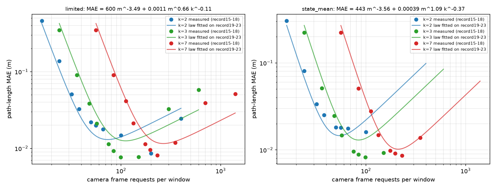
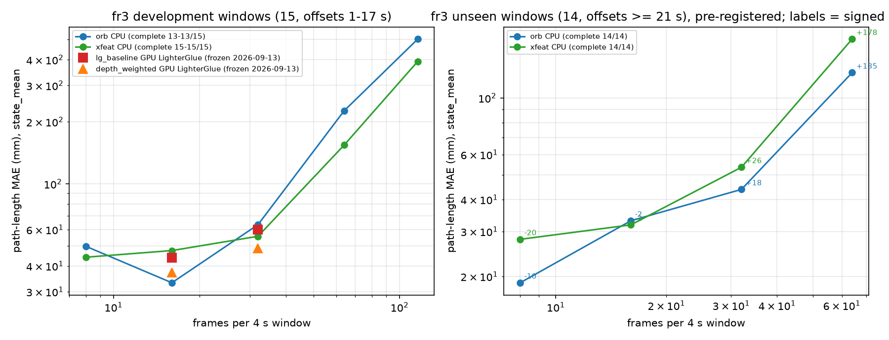

# 观察分配三项后续：一致性规则、显式分配律、TUM 迁移

完成时间（UTC）：2026-09-15。承接 [观察分配确认](OBSERVATION_ALLOCATION_DENSE_FEWVIEW_2026-09-15.md)。全部 CPU，无模型训练。

## 总结

1. **一致性规则（负结果 + 边界）**：把冻结的三视角规则原样接入稠密少视角链，会把"仅 2 路可见"的时刻一律拒绝（确认集 12,000 时刻中 1,412 个），导致 16/60 窗口失败、m≤50 全部变差；真正被几何一致性剔除的只有 5 个时刻。改用卡尔曼创新门控后，稠密区（m≥50）的噪声累计尾部被修掉（开发集 k=3、m=200：中位 MAE 0.038→0.006 m，35 个三元组 34 个改善），但稀疏区（m≤33）它把真实快速运动当异常，反而变差。**等成本候选 3×19 保持原冻结结果（0.0149 m、零失败）**；那次 3.08 m 异常（m=16、某时刻退化为两视角）两种保护都没有干净地解决。
2. **显式分配律（成立）**：MAE(m,k) = a·m^−p + b·m^q·k^−r 在开发集拟合后，确认集上中位相对误差 20%（状态均值）/27%（限幅曲线），对数 RMS 0.27/0.38；在 6 个预算档中，按律预测的最优 (k,m) 与实测最优一致 3–4 档，其余档遗憾 7–55%，且从不选到旧协议角落。采样项 p≈3.5，说明漏采运动随时刻数下降极快。
3. **TUM 迁移（成立，方向相反）**：分配律预测慢运动、链式配准噪声的相机自运动场景最优在低帧数。fr3 三段序列上 14 个从未使用的窗口（偏移 ≥21 s）预注册验证：ORB CPU 8 帧 MAE **18.9 mm** < 16 帧 33.0 < 32 帧 43.8 < 64 帧 125.6，四项门槛全过、14/14 完成；XFeat CPU 8 帧 27.9 < 31.8 < 53.5 < 170.0，只有 sitting_xyz 一段 8 帧略差于 32 帧，逐序列条件未过。开发窗口上 XFeat CPU 8 帧（44.1 mm，15/15，2.1 s/窗口）与冻结的 GPU LighterGlue 16 帧（43.8 mm）持平。

两个数据集给出同一条律的两个极端：MCalib 快速手部运动（约 1.7 m/s，逐点噪声 2 mm）→ 越密越好；TUM 慢速自运动（每帧约 7 mm，每条边配准噪声约几 mm 且沿链累积）→ 越稀越好。决定观察分配的量是"每个采样间隔内的运动量"与"每次观测的噪声"之比，这是能事先从数据估出来的。

## 1. 一致性规则接入稠密少视角链

### 1.1 冻结三视角规则原样接入

k=3 子集：3 路可见用 `three_view_triangulate`（重投影 ≤4 px、射线夹角 ≥5°、两两点差 ≤2 cm），2 路可见按原规则拒绝；k=7 用冻结的 ≥4 视角共识；k=2 无法带规则，不跑。同一封存流程，确认集 record15–18。

| 规则三元组 `216f21c1+3e0f8f0+44c4b2e` | 帧 | 规则关 MAE | 规则开 MAE | 失败（关→开） |
|---|---:|---:|---:|---|
| m=19，状态均值 | 57 | 0.0149 | 0.0259 | 0 → 16/60 |
| m=33，状态均值 | 99 | 0.0093 | 0.0160 | 0 → 16 |
| m=100，限幅曲线 | 300 | 0.1206 | 0.0080 | 0 → 16 |
| m=200，限幅曲线 | 600 | 0.1224 | 0.0076 | 0 → 16 |

全部 35 个三元组：m=19 状态均值 0/35 改善（中位 0.0147→0.0441），m=33 限幅 0/35 改善。拒绝原因（规则三元组，12,000 时刻）：`insufficient_visible_views` 1,412、`three_view_inconsistent` 3、`three_view_pair_disagreement` 2。开发集（35 三元组 × 15,000 时刻）：insufficient 71,551、small_ray_angle 5,934、pair_disagreement 4,468、inconsistent 80。7 视角的稳健规则在 m≤33 不改变结果，在 m≥50 明显改善（m=200：0.0511→0.0047）。

结论：这条规则为"7 视角、少数异常"设计，它的"两视角必拒"在少视角稠密链中是主要伤害来源；几何一致性检查本身几乎不触发。

### 1.2 创新门控（时间一致性）

`gated_state_cpu.gate`：用无门控 NLL 选出的 q 跑一遍前向 Wiener 速度滤波，归一化创新平方（3 自由度）>16.27 的时刻剔除；前两个时刻不剔；末时刻被剔则查询失败。3 路可见做几何检查，2 路可见接受再交门控。开发集 record19–23：

| k=3（35 三元组，中位 MAE） | m=16 | m=19 | m=33 | m=50 | m=100 | m=200 |
|---|---:|---:|---:|---:|---:|---:|
| 门控关 | 0.0237 | — | 0.0087 | 0.0263 | 0.0144 | 0.0377 |
| 门控开 | 0.0293 | — | 0.0120 | 0.0114 | 0.0063 | 0.0061 |
| 改善子集数 | 0/35 | — | 1/35 | 26/35 | 29/35 | 34/35 |
| 最大 MAE 关→开 | 0.027→0.058 | | 0.013→0.039 | 0.286→0.171 | 0.146→0.066 | 0.245→0.009 |

k=7：m=200 0.0319→0.0050，P95 0.227→0.014；m≤33 略差。门控共剔除 45,165 次观测——在稀疏区它剔除的是真实运动。固定阈值和固定 σ=3 mm 不随采样间隔缩放，是明确的设计缺陷；不在确认集上调阈值。确认集稠密区（k=3,7）补跑结果见附录 A。

### 1.3 对等成本候选的影响

无。3×19 在确认集上保持 0.0149 m、零失败；两种保护都不适用于该区间。那次 m=16 的 3.08 m 异常在规则版里变成失败窗口，在门控版里（开发集同类情况）能被剔除但代价是稀疏区整体变差。可行的下一步是让门控阈值随 Δt 和运动量自适应，或只对"2 路可见"的时刻施加门控；都需要先在开发集设计。

## 2. 显式分配律

模型：MAE(m,k) = a·m^−p + b·m^q·k^−r，两项分别对应漏采运动与逐点噪声累计。对每个 (k,m) 取相机子集中位数（k=2/3）或单值（k=7），对数空间最小二乘，只用开发集拟合。

| 估计器 | a | p | b | q | r | 开发集 log-RMS | 确认集 log-RMS | 确认集中位相对误差 |
|---|---:|---:|---:|---:|---:|---:|---:|---:|
| 状态均值（m≤50） | 443 | 3.56 | 3.9e-4 | 1.09 | 0.37 | 0.257 | 0.268 | 19.6% |
| 限幅曲线 | 600 | 3.49 | 1.1e-3 | 0.66 | 0.11 | 0.266 | 0.377 | 26.9% |

预算档内按律选 (k,m)，与确认集实测最优比较（状态均值）：≤50 帧 预测 (2,25)=实测；≤60 预测 (2,28) 实测 (3,19)，遗憾 23%；≤75 (3,25)=实测；≤100/150 预测 (3,28) 实测 (3,33)，遗憾 7%；≤200 预测 (7,28) 实测 (3,33)，遗憾 10%。限幅曲线：6 档中 5 档命中，一档遗憾 55%。

边界：下降段拟合好，噪声回升段被低估（k=2/3 的实测底部约 0.008 m 受参考分辨率限制，律没有这一项）；k 的作用（r≈0.1–0.4）远弱于 m。律是描述性的经验模型，不是不确定性保证。仍是同装置数据。

## 3. TUM 相机自运动迁移

### 3.1 设计

fr3 三段序列（structure_texture_far / nostructure_texture_near_withloop / sitting_xyz），冻结的 4 s 窗口规则。链路与冻结的 LighterGlue 刚体链完全一致（均匀选帧 → 特征 → 匹配 → 成对深度过滤 → `solve_rigid` → 位姿链 → 状态均值/限幅/折线），只把前端换成 CPU 的 ORB-2000（Hamming、0.75 比值）或 XFeat-2000（互近邻）。首条失败边使查询失败，不桥接。帧数 8/16/32/64/全部（约 117）。

开发：已见的 15 个窗口（偏移 1–17 s），与冻结的 GPU LighterGlue B16/B32 结果对照。确认：同三段序列偏移 ≥21 s 的全部有效窗口（far 2、near 7、sitting 5，共 14），此前从未使用；协议、门槛、源码哈希在读取前冻结，预测先封存。

### 3.2 开发窗口（15）

| 前端 | 帧 | 完成 | 路程 MAE（状态均值，mm） | 有符号偏差 mm | 位置 RMSE mm | CPU 秒/窗口 |
|---|---:|---:|---:|---:|---:|---:|
| ORB | 8 | 13/15 | 49.8 | −28 | 31.7 | 1.0 |
| ORB | 16 | 13/15 | 33.2 | +13 | 37.2 | 1.7 |
| ORB | 32 | 13/15 | 63.4 | +23 | 33.9 | 3.6 |
| ORB | 64 | 13/15 | 225.9 | +232 | 44.8 | 7.4 |
| ORB | 116 | 13/15 | 503.5 | +556 | 44.4 | 13.9 |
| XFeat | 8 | 15/15 | 44.1 | −32 | 27.8 | 2.1 |
| XFeat | 16 | 15/15 | 47.5 | −23 | 29.7 | 4.3 |
| XFeat | 32 | 15/15 | 55.7 | 0 | 28.3 | 8.9 |
| XFeat | 64 | 15/15 | 154.1 | +113 | 34.3 | 18.3 |
| XFeat | 116 | 15/15 | 392.4 | +358 | 41.7 | 33.5 |
| LighterGlue GPU（冻结） | 16 | 15/15 | 43.8 | | 27.4 | — |
| 深度加权 GPU（冻结） | 16 | 15/15 | 37.3 | | 24.8 | — |
| LighterGlue GPU（冻结） | 32 | 15/15 | 60.1 | | 28.6 | — |

偏差符号从稀疏的负（漏采）翻到稠密的正（噪声抬高路程），交叉点在 16–32 帧。ORB 的 2 个失败全在 sitting_xyz（刚体共识不足），是它的真实限制。

### 3.3 未见窗口（14，预注册）

| 前端 | 帧 | 完成 | MAE mm | 偏差 mm | far / near / sitting | 秒/窗口 |
|---|---:|---:|---:|---:|---|---:|
| ORB | 8 | 14/14 | **18.9** | −10 | 2.6 / 14.7 / 39.4 | 0.9 |
| ORB | 16 | 14/14 | 33.0 | −2 | 8.0 / 38.7 / 52.4 | 1.7 |
| ORB | 32 | 14/14 | 43.8 | +18 | 5.2 / 53.5 / 72.8 | 3.6 |
| ORB | 64 | 14/14 | 125.6 | +135 | 18.1 / 273.7 / 85.0 | 7.4 |
| XFeat | 8 | 14/14 | **27.9** | −20 | 6.2 / 21.5 / 56.1 | 2.1 |
| XFeat | 16 | 14/14 | 31.8 | −2 | 15.9 / 32.7 / 46.9 | 4.4 |
| XFeat | 32 | 14/14 | 53.5 | +26 | 43.1 / 67.4 / 50.1 | 9.0 |
| XFeat | 64 | 14/14 | 170.0 | +178 | 123.2 / 328.1 / 58.8 | 18.2 |

预注册门槛（B8 < B32、B8 < B64、逐序列 B8 ≤ B32、完成数不降）：ORB 全部通过；XFeat 前两项和完成通过，sitting_xyz 的 B8（56.1）比 B32（50.1）差 6 mm，逐序列条件未过。B8 对 B16 为次要比较：两前端 B8 均更好。

这些未见窗口上没有 LighterGlue 参照（本机 Windows 环境缺 kornia，GPU 适配器无法加载；此前 fr3 结果在 WSL 产生），因此"CPU 8 帧 ≈ GPU 16 帧"只能在开发窗口上说。TUM 的绝对误差还受参考分辨率影响（此前测得隔点抽取就改变约 7 mm），18.9 mm 与 27.9 mm 之差不应过度解读。

### 3.4 含义

在 TUM 上，"更便宜的前端跑更多帧"是错的方向；正确的是"更便宜的前端跑更少帧"，而且同样成立。分配律给出的理由是通用的：链式相对位姿的误差每条边都不缩小，帧越密噪声累计越多，而 4 s 内约 0.8 m 的平滑运动用 8 个时刻就几乎不漏。这与 MCalib 相反，但出自同一条律。此前三天在 TUM 上比较的 B16 与 B32（B32 反而更差）也是这条律的表现。

## 4. 可声称与不可声称

- 可声称：分配律的结构在两个数据集、两个方向上得到预注册验证；等成本最优分配可从开发集预测；两个数据集的最优点都远离原协议的默认设置。
- 不可声称：跨实验室泛化（MCalib 同一装置、TUM 同三段序列的不同时段）；端到端 RGB 成本（MCalib 仍用发布者二维缓存，成本单位为相机帧请求）；稠密少视角在有异常时的可靠性（保护机制未定型）；TUM 上 CPU 前端与 GPU 前端的未见窗口对照。

## 5. 复现

- 规则版：`python src/run_allocation_rule.py --split confirm|dev --out ...`（确认 226 s，开发约 20 min）。
- 门控版：`python src/run_allocation_gate.py --split dev|confirm --sizes 2,3,7|3,7 --out ...`（开发 1,866 s）。
- 分配律：`python src/fit_allocation_law.py`、`python src/plot_allocation_law.py`。
- TUM：`python src/run_tum_dense_cheap_v1.py run|evaluate`（开发 1,422 s，150 行）；`python src/run_tum_dense_cheap_confirm.py freeze|run|evaluate`（确认 662 s，112 行）；`python src/plot_tum_allocation.py`。
- 目录：`experiments/allocation_rule_{confirm,dev}_v1_2026-09-15`、`allocation_gate_{dev,confirm}_v1_2026-09-15`、`tum_dense_cheap_v1_2026-09-15`、`tum_dense_cheap_confirm_v1_2026-09-15`。fr3 偏移 ≥21 s 的窗口从此为已见。

## 附录 A：确认集稠密区门控（k=3,7）

record15–18，门控参数与开发集相同（未调），790 s，剔除 12,412 次观测。与开发集同一模式：

| k=3（35 三元组，中位 MAE） | m=16 | m=19 | m=33 | m=50 | m=100 | m=200 |
|---|---:|---:|---:|---:|---:|---:|
| 门控关 | 0.0245 | 0.0147 | 0.0083 | 0.0093 | 0.0325 | 0.0579 |
| 门控开 | 0.0312 | 0.0193 | 0.0099 | 0.0091 | 0.0063 | 0.0058 |
| 改善子集数 | 15/35 | 0/35 | 6/35 | 15/35 | 26/35 | 34/35 |
| 最大 MAE 关→开 | 0.112→0.061 | 0.018→0.038 | 0.012→0.041 | 0.062→0.014 | 0.199→0.045 | 0.222→0.008 |
| 失败窗口合计 关→开 | 0→235 | 0→140 | 0→224 | 0→205 | 0→151 | 0→107 |

k=7：m=100 0.0389→0.0058（P95 0.126→0.017）、m=200 0.0511→0.0047（P95 0.500→0.012），m≤33 基本不变。规则三元组 m=16 的 3.08 m 异常窗口被门控剔除（该设置 MAE 0.0728→0.0263），但 m=19 等成本候选反而从 0.0149 变为 0.0166。结论不变：固定参数的门控是稠密区工具；稀疏区需要随采样间隔缩放的阈值，且必须先在开发集设计。
