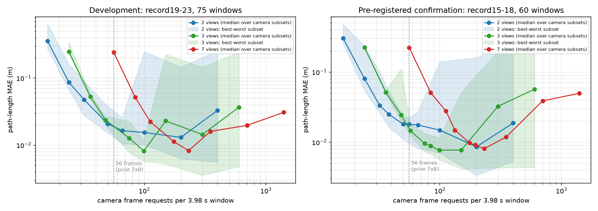

# 观察分配：时间密度对视角冗余——MCalib 预注册确认

完成时间（UTC）：2026-09-15。范围：MCalib 发布者二维观测缓存 + 独立动捕参考，全部 CPU，无模型训练。

**结论：在相同的相机帧请求成本下，把观察预算从"7 台相机 × 8 个时刻"改为"3 台相机 × 19 个时刻"，路程误差从 0.2234 m 降到 0.0149 m（下降 93.3%），4 个预先冻结的确认记录全部改善，零失败，通过全部预注册门槛。** 这三天的 MCalib 主线一直把"每个时刻请求全部 7 路相机"当作固定前提，并只在"选哪 8 个时刻"上寻找收益；本轮证明最大的误差项（采样漏掉的运动）不是靠选帧规则，而是靠改变观察的分配方式消除的。

这是低成本传统链上的分配发现，不是学习型策略，也不是端到端 RGB 验证。边界见末节。

## 1. 起点：为什么选这个方向

三天总结中最可靠的证据链指向同一个瓶颈：MCalib 预算 8 时刻时路程误差约 0.24–0.37 m，而 33 时刻时只有 0.008 m；稳健三角化在密集采样下改善 84%，在 8 时刻下只改善 0.3%；真值辅助枚举显示 8 时刻内最优组合也只能改善约 35%，且没有任何可部署规则捕获它。误差主要来自"两次观察之间没看到的运动"，而不是单点定位噪声。

因此本轮不再问"哪 8 个时刻更好"，而是问：**同样的帧成本，应该花在更多时刻上，还是花在每个时刻的更多视角上？** 这个问题此前没有被检验过。

先做了一个更复杂的候选（单相机稠密二维方位 + 稀疏三维锚点融合，见第 5 节），它在开发集上有收益，但被一个更简单的对照压倒：两台相机稠密观测。于是主线切换为观察分配扫描。

## 2. 实验设计

- **数据**：MCalib `mocapAssistedRecord`，7 台相机 50 Hz 二维标记点缓存，200 Hz 动捕参考；标定沿用 record3 冻结外参。每记录 15 个不重叠 3.98 s 窗口（起点 0,200,…,2800，终点 +199）。
- **开发集**：record19–23，75 窗口（已在此前多轮使用）。
- **确认集**：record15–18，60 窗口。这四个记录此前只用于逐帧三角化精度核验（robust_triangulation_2026-09-13），从未用于任何路程估计、采样或本轮设计。协议、源码哈希和相机子集在读取这四个记录前冻结；全部预测先封存（SHA-256）再读取参考。
- **成本单位**：相机帧请求数 = 视角数 k × 时刻数 m，缺失检测同样计费（沿用既有协议）。
- **分配网格**：k ∈ {2,3,7}（全部 21 个相机对、35 个三元组、全 7 路），m ∈ {8,12,16,19,25,28,33,50,100,200}，均匀选时刻。三角化为普通 DLT，无稳健规则。
- **估计器**：折线、限幅曲线、Wiener 速度状态均值（σ=3 mm，q 按创新似然选）。开发集显示 m≤33 时状态均值最好，m>33 时限幅曲线最好；确认候选的估计器据此在冻结前指定。
- **失败规则**：某时刻可见视角 <2 则丢弃该时刻；任一端点缺失则该查询失败。失败计入分母，不从比较中删除。
- **相机子集规则（仅用标定）**：先由 7 条光轴的最近点算出场景中心，再按"最差相机对的 z/(f·sin 夹角)"预测误差尺度，取最小者。得到 k=2：`3e0f8f0+44c4b2e`，k=3：`216f21c1+3e0f8f0+44c4b2e`。开发集上该规则与实际误差的 Spearman 仅 0.35（k=2）/0.14（k=3），是弱规则；但结论不依赖它，见第 3.3 节。
- **预注册主门槛**：候选帧数 ≤57，相对"7×8 + 状态均值"（56 帧）MAE 下降 ≥50%，每个记录都改善，失败数不增加。

冻结与封存：[config.json](../experiments/allocation_confirm_v1_2026-09-15/config.json)、[freeze.json](../experiments/allocation_confirm_v1_2026-09-15/freeze.json)、[prediction_seal.json](../experiments/allocation_confirm_v1_2026-09-15/prediction_seal.json)（封存 UTC 16:00:49，之后才首次读取参考）。

## 3. 确认集结果（record15–18，60 窗口）

### 3.1 预注册候选

| 分配 | 帧/窗口 | 估计器 | MAE m | P95 m | 失败 | 逐记录 MAE（15/16/17/18） | 主门槛 |
|---|---:|---|---:|---:|---:|---|---|
| 7 视角 × 8 时刻（旧协议） | 56 | 状态均值 | 0.2234 | 0.611 | 0/60 | 0.192 / 0.258 / 0.210 / 0.234 | 基线 |
| 7 视角 × 12 时刻 | 84 | 状态均值 | 0.0508 | 0.131 | 0/60 | — | 对照 |
| **3 视角 × 19 时刻** | **57** | 状态均值 | **0.0149** | 0.035 | **0/60** | 0.015 / 0.015 / 0.015 / 0.015 | **通过** |
| 2 视角 × 28 时刻 | 56 | 状态均值 | 0.0125 | 0.037 | **12/60** | 0.012 / 0.012 / 0.014 / 0.012 | **未通过（失败数）** |
| 2 视角 × 33 时刻 | 66 | 状态均值 | 0.0112 | 0.025 | 12/60 | — | 不在主门槛内 |

3×19 候选：MAE 下降 93.3%，4/4 记录改善，零失败，四项条件全部满足。它在 57 帧上达到的精度，旧协议需要 7×19=133 帧（确认集 0.0149 m）才能达到，即**同精度下帧成本约为 43%**。

2 视角候选的成功窗口精度更高，但 12 个窗口因某个端点在两台相机之一中缺失而失败（record15 的 200–800、record18 的 200–800 等，是标记点离开单台相机视野的连续段）。按预注册规则，它没有通过。这是真实的覆盖限制，不能靠换估计器修复。

### 3.2 整条误差—成本前沿

两个面板形状一致：在 20–100 帧区间，2–3 视角的曲线整体位于 7 视角曲线左下方约一个数量级；超过 100–200 帧后，所有曲线因逐点噪声累计而回升（折线/限幅曲线不去噪；状态均值只算到 m=50）。旧协议的 56 帧点落在 7 视角曲线最陡的一段上。

确认集 7 视角阶梯：8→0.2234，12→0.0508，16→0.0279，19→0.0149，25→0.0098，33→0.0081 m。规则三元组阶梯：19→0.0149（57 帧），25→0.0101（75 帧），33→0.0093（99 帧）。

### 3.3 不依赖相机子集选择

在确认集等成本设置下枚举所有子集（状态均值，成功窗口 MAE）：

| 分配 | 子集数 | MAE 最小 / 中位 / 最大 | 有失败的子集 | 每子集最多失败窗口 |
|---|---:|---|---:|---:|
| 3 × 19（57 帧） | 35 | 0.0125 / 0.0147 / 0.0184 | 0 | 0 |
| 2 × 28（56 帧） | 21 | 0.0097 / 0.0181 / 0.0223 | 21 | 24 |

**所有 35 个三元组、所有 21 个相机对的成功窗口 MAE 都低于旧协议的 0.2234 m。** 最差的三元组也比旧协议好 12 倍。因此收益来自分配本身，而不是挑对了相机；标定规则只是把三元组从中位 0.0147 选到 0.0149，几乎无作用。

开发集同样：2×25（50 帧）中位 0.0208、最差 0.0381；3×16（48 帧）中位 0.0237、最差 0.0268；旧协议 0.2434。

## 4. 失败与风险：少视角没有共识检查

- **覆盖失败**：2 视角在开发集每个相机对失败 2–32 窗口（中位 15/75），确认集 4–24（中位 13/60）；3 视角开发集最多 1 窗口，确认集 0。三视角是本装置下"最少而不失败"的视角数。
- **无共识异常**：3 视角普通 DLT 在某个时刻只剩 2 路可见时没有任何异常检测。确认集规则三元组在 m=16 时出现一次 3.076 m 的路程错误（record17 起点 200，该时刻缺失 1 路，退化为两视角 DLT），使该设置 MAE 0.0728 m 高于自身 P95。预注册的 m=19 候选没有碰到这个时刻，但风险是真实的。此前已冻结的"恰三路一致性规则"（重投影 ≤4 px、射线夹角 ≥5°、两两点差 ≤2 cm）正是针对这种情况，本轮为保持普通 DLT 对照没有启用；下一轮应把它接进来并保留失败计数。
- **过密采样回升**：m≥100 时逐点噪声累计使折线/限幅曲线误差回升到 0.03–0.12 m。这说明"越密越好"只在噪声可控的范围内成立，也是状态均值/去噪估计器要覆盖的区间。

## 5. 附带结果：单相机方位 + 稀疏锚点融合（开发集）

在切换方向之前，先实现了"1 台相机在 33 个候选时刻的二维方位（廉价预览）+ 8 个时刻的 7 视角三维锚点"的融合：沿相机射线插值锚点深度重建稠密三维点（`bearing_fusion_cpu.ray_depth_reconstruct`），以及带射线约束的 3D Wiener 速度 RTS 平滑器（`bearing_smoother`）。开发集 75 窗口：

| 方法 | 帧/窗口 | MAE m |
|---|---:|---:|
| 7×8 锚点 + 状态均值 | 56 | 0.2418 |
| 锚点 + 单相机方位 RTS 平滑 | 87 | 0.0825 |
| 锚点 + PCHIP 深度插值 + 限幅曲线 | 87 | 0.1260 |
| 7×12 锚点 + 状态均值（等成本对照） | 84 | 0.0519 |
| 2 相机 × 33 时刻 + 限幅曲线 | 66 | 0.0093 |

融合确实比同锚点基线好 66%，但在等帧成本下输给"多买 4 个时刻"，更远输给两相机稠密。预览相机的选择影响很大（单相机方位重建 MAE 在 0.021–0.168 之间，取决于运动方向与光轴的关系）；"最小中位深度"规则选得不好。**该路线在本装置下不值得继续。** 它对单目视频（只有一台相机、深度昂贵）仍可能有意义，但那是另一个数据设置，本轮不作声称。代码与结果保留：[bearing_fusion_cpu.py](../src/bearing_fusion_cpu.py)、[开发结果](../experiments/bearing_fusion_dev_v1_2026-09-15/summary.json)。

## 6. 这个结果对课题意味着什么

1. **"何时观察"在这批数据上的正确形式是"观察什么"。** 固定 7 视角后，任何选帧规则都在 8 个时刻里挣扎；把每时刻的视角从 7 降到 3，时刻从 8 升到 19，误差直接进入毫米区。这与三天总结第 4 条一致：缺的不是更复杂的选帧网络，而是能预测测量收益的信号。这里的信号是简单的：路程误差对时间间隔的敏感度远高于对逐点定位噪声的敏感度。
2. **可写成一条可检验的分配律。** 误差 ≈ 采样项（随 m 快速下降）+ 噪声累计项（随 m 上升、随 k 下降）。前沿图两个面板形状一致，说明它在同装置的未见记录上可预测。把它拟合成显式模型并用于预算分配决策，是比学习选帧更直接的方法贡献候选。
3. **原有正结果全部保留并叠加**：状态均值估计器仍是低时刻数下最好的估计器；稳健/三视角一致性规则正是少视角分配需要的保护；深度加权等 TUM 结果不受影响。
4. **不能声称的**：这不是端到端 RGB；成本单位是"相机帧请求"，没有计入检测、解码、同步等真实开销，也没有证明在真实系统里 3 路×19 时刻的墙钟成本等于 7 路×8 时刻；同一相机阵列、同一采集设置，不是跨实验室泛化；确认集 4 记录来自同一天的同一装置。

## 7. 下一步（按价值排序）

1. **把三视角一致性规则接入少视角稠密链**，重跑确认集，检查是否消除 3.076 m 类异常且不新增失败。这是把"最优分配"变成"可靠分配"的必要一步。
2. **显式分配模型**：在开发集上拟合 MAE(m,k) 的两项模型，在确认集上检验预测的最优 (m,k) 是否落在实测前沿上。若成立，它本身就是"预测观察收益"的机制，且不需要训练。
3. **迁移到 TUM 相机自运动代理**：那里的对应物是"更低分辨率/更便宜的前端在更多帧上"对"完整前端在 16 帧上"。已有固定帧缓存可以复用；需要先定义可比的成本单位。
4. **单目 + 昂贵深度的设置**再回头看第 5 节的方位融合；在多相机装置里它已被证明不是最优。

## 8. 复现与核验

- 开发扫描：`python src/run_allocation_sweep.py --split dev --out experiments/allocation_sweep_dev_v1_2026-09-15`（855,000 次三角化，336.8 s）。
- 确认：`python src/run_allocation_confirm.py freeze|predict|score`（预测 337.2 s，91,260 行）。
- 修正汇总：`python src/score_allocation_v2.py <目录>`。原 `score` 的汇总把失败只记在折线名下，导致状态均值/限幅曲线的失败数显示为 0、样本数被减少；[decision.json](../experiments/allocation_confirm_v1_2026-09-15/decision.json) 保留原样，本报告全部数字来自 [decision_v2.json](../experiments/allocation_confirm_v1_2026-09-15/decision_v2.json) 与 [summary_v2.json](../experiments/allocation_confirm_v1_2026-09-15/summary_v2.json)。预测与参考未改动。
- 前沿图：`python src/plot_allocation_frontier.py`。
- 新增测试 6 项（`tests/test_bearing_fusion.py`）通过；全套 751 项中 5 项错误均为缺少 `kornia` 的 GPU 前端测试导入失败，与本轮无关。
- 输入哈希：[input_hashes.json](../experiments/allocation_confirm_v1_2026-09-15/input_hashes.json)。record15–18 今后不能再作为未见验证数据。
